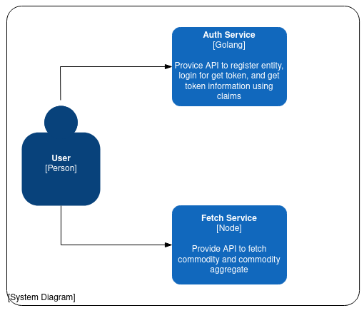
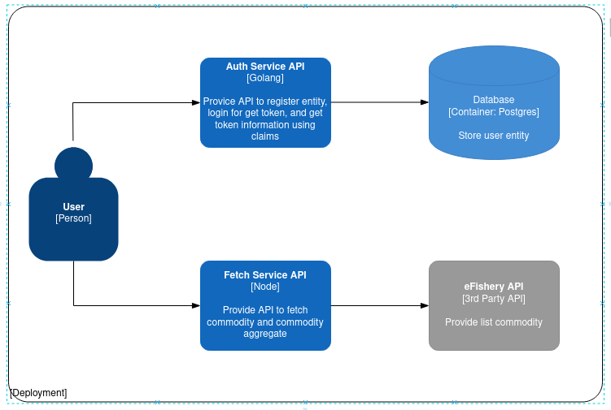

## delta-monorepo

## Prerequisite

- go1.19
- Node
- PostgreSQL
- Docker

## Getting Started

### Docker

```bash
# docker build & start
docker-compose up -d

# docker stop & remove
docker-compose down -v
```

### Manualy

```bash
git clone https://github.com/kmohhidayah/delta-monorepo.git
```

#### auth-app

```bash
cd delta-monorepo
cd auth-app
cp .env.example .env
make postgres
make createdb
```

#### fetch-app

```bash
cd delta-monorepo
cd fetch-app
cp .env.example .env
yarn
yarn dev
```
#### Document C4 (Context and Deployment)




